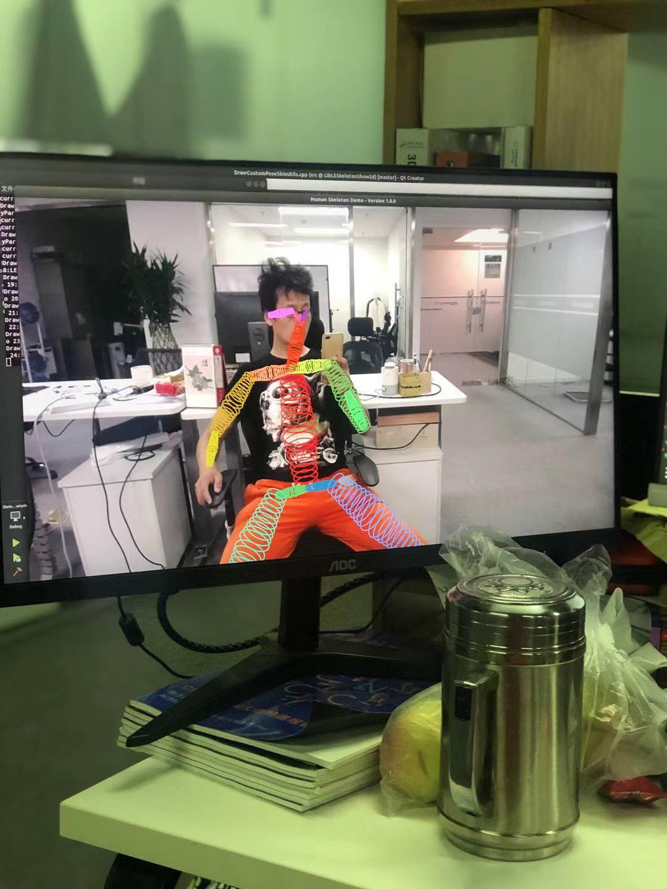

#LibLSSkeletonShow2d--Released lib version of HumanSkeletonShow2D

## Introduction

Libraries of Human Skeleton Show， 2D version。

Features：

Functionality:
2D real-time multi-person skeleton show using Rainbow spring.

##Installation

Operating Systems
Ubuntu.(Test passed on 18.04)

##Requirements and Dependencies

###1.OpenPose

[https://github.com/CMU-Perceptual-Computing-Lab/openpose](https://github.com/CMU-Perceptual-Computing-Lab/openpose "https://github.com/CMU-Perceptual-Computing-Lab/openpose")

(version: 1.5.0 recommended and test passed).

LibLSSkeletonShow2dExample.pro

Requirements for the default configuration (you might need more resources with a greater --net_resolution and/or scale_number or less resources by reducing the net resolution and/or using the MPI and MPI_4 models):

###2.CUDA (Nvidia GPU)

 (version: 10.1 recommended and test passed).

NVIDIA graphics card with at least 1.6 GB available (the nvidia-smi command checks the available GPU memory in Ubuntu).
At least 2.5 GB of free RAM memory for BODY_25 model or 2 GB for COCO model (assuming cuDNN installed).

###3. cuDNN

(version: 7.4.2.4 recommended and test passed).

###4. OpenCV (all 2.X and 3.X versions are compatible).

3.4.2 recommended and test passed!

###5. Caffe and all its dependencies. 
Interesting in porting OpenPose to other DL frameworks (Tensorflow, Caffe2, Pytorch, ...)?. Email us (gines@cmu.edu) if you are interesting in joining the OpenPose team to do so or feel free to make a pull request if you implement any of those!
The demo and tutorials additionally use GFlags.

###6. CMake

3.15.0 recommended and test passed!

###7. Qt

5.13.0 recommended and test passed!

###7. GCC

7.4.0 recommended and test passed!

##Quick start
*How to use:*

**Step 1:**
Copy the all the shared library files( .so, .so.1, .so.1.0, .so.1.0.0) in the directory lib/x64/Release into your system library folder 
==/usr/lib/x86_64-linux-gnu==
to use them: 

**Step 2:**
Copy the whole models folder from openpose project folder into the same directory with your compiled executable program file( LibLSSkeletonShow2dExample ), here is :
*==QT_Creator/test/x64/Release==*
or:
*==QT_Creator/test/x64/Debug==*.

**Step 3:**
Add the right path to include the libraries in your .pro file or configure in your Makefile.

**Step 4:**
Add header files(include/skeletonshow2d.h is indispensable) in your code.

**Step 5:**
Create an OpenCV Mat.

**Step 6:**(Optional)
Initialize the library by calling :

*
==void ls::SkeletonShow2D::initOpenPose();==*

**Step 7:**

Pass the cv::Mat as input image and the body key points calculated by openpose as parameters and calling the function:

*==cv::Mat ls::SkeletonShow2D::getOutputImage(cv::Mat inImage, const op::Array<float> &keyPoints)==*;

or:

*==cv::Mat ls::SkeletonShow2D::getOutputImage1(cv::Mat inImage, const float *keyPoints, int arrLength)==*;

**Step 8:**

Show the output image data in your app.

##Example:
Open 
*==LibLSSkeletonShow2dExample.pro==* 
in *Qt 5.13.0.*

Example running screenshot:

    

Figure 1.

    

Figure 2.

Example running screenshot:

    

Figure 3.

    

Figure 4.

